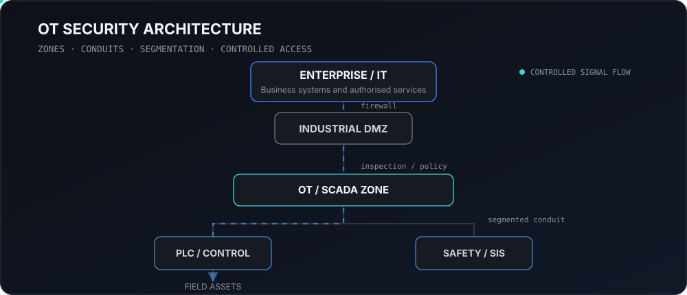

  

  <a href="https://arunrajagopal-ot.github.io/">Website</a> ·
  <a href="https://www.linkedin.com/in/arajagopal/">LinkedIn</a> ·
  Chartered Engineer · London, United Kingdom

---

## Engineering industrial cybersecurity

I work where **industrial engineering, cybersecurity and operational risk** meet. My background spans more than 25 years across automation, control systems, engineering leadership and cybersecurity.

I focus on turning cyber requirements into engineering decisions that support **safety, availability and operational continuity** — from architecture and risk assessment through product security and assurance.

  

## Engineering focus

**OT SECURITY ARCHITECTURE**  
Zones and conduits · IT/OT segmentation · secure remote access · supplier integration

**RISK & ASSURANCE**  
IEC 62443 risk assessment · NCSC CAF · NIS/NIS2 · design and commissioning assurance

**PRODUCT SECURITY**  
Secure development · vulnerability management · IEC 62443-4-1 / 4-2 · Cyber Resilience Act

**STRATEGY & LEADERSHIP**  
Cybersecurity governance · improvement roadmaps · programme delivery · engineering leadership

## Systems, standards & domains

`IEC 62443` `NCSC CAF` `NIS / NIS2` `Cyber Resilience Act` `ISO/SAE 21434`

`PLC` `SCADA` `DCS` `SIS` `Industrial Networks` `Critical Infrastructure`

Oil & gas · Energy & renewables · Rail & transportation · Pharmaceuticals & life sciences · Manufacturing · Aviation

## What this GitHub is for

This is my technical workspace for practical material around **OT security architecture, industrial cybersecurity engineering, standards-led assurance and secure-by-design thinking**.

Rather than duplicate my professional website, I use GitHub to share technical work, architecture patterns, engineering notes and projects that can be inspected, reused and improved.

<strong>Credentials & professional standing</strong>

 

- **Chartered Engineer (CEng)** — Engineering Council UK
- **ISA/IEC 62443 Cybersecurity Expert**
- **ISASecure ACSSA for Evaluators Specialist (IC49)**
- **Certified Functional Safety Expert** — TÜV SÜD
- **Certified Automotive Cybersecurity Practitioner (CACSP)** — TÜV SÜD, ISO/SAE 21434
- **Senior Member, International Society of Automation** and former President, ISA UK Section
- Executive MBA — Henley Business School
- BEng (Hons), Electronic & Communication Engineering — Robert Gordon University, Aberdeen

---

  <strong>Industrial systems. Practical cybersecurity. Engineering-led assurance.</strong>  
  <a href="https://arunrajagopal-ot.github.io/">Professional website</a> ·
  <a href="https://www.linkedin.com/in/arajagopal/">LinkedIn</a>

